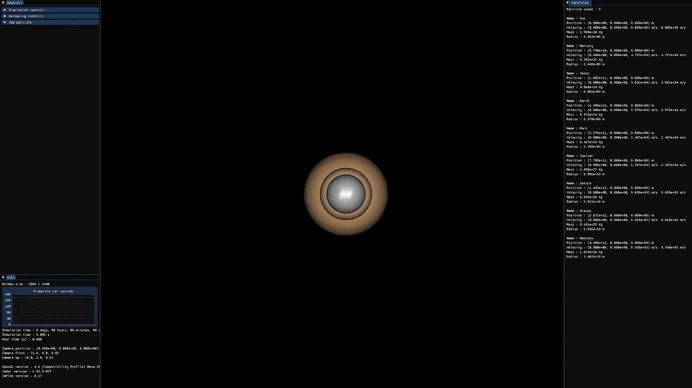

# Particle Simulation


[](https://builtwithnix.org)

This project is a particle simulation using the C++ programming language. It models the interaction of particles in a 3D universe and render it using the the [GLFW](https://www.glfw.org/) library.


## 🖼️ Gallery

<p align="center">
    <br>
</p>


## 📐 Explicit Euler for Particle Dynamics Resolution

In this particle simulation, the explicit Euler method is employed to resolve particle dynamics. This method is a numerical approach for solving first-order ordinary differential equations, such as those describing particle motion in our simulated universe.\
For more details see [Euler method Wiki Page](https://en.wikipedia.org/wiki/Euler_method).

In our case, the formula for updating the position and velocity of particles using the explicit Euler method can be expressed as follows:\
For velocity : `newVelocity = currentVelocity + acceleration * deltaTime`\
For position : `newPosition = currentPosition + velocity * deltaTime`\
Where `deltaTime` is the size of the time step used in the simulation.

The explicit Euler method is simple to implement but can introduce approximation errors. More advanced numerical methods, such as Runge-Kutta methods or Verlet integration, can be employed to obtain more accurate results in certain cases.

## 📚 Features

- Particle initialization :
  - Particles are initialized with different parameters, acceleration is set to zero.

- Universe initialization :
  - Universe is initialized with different parameters.

- Universe simulation :
  - Particle-particle collisions
  - Particle-boxes collisions.
  - Global acceleration set to all particles.
  - Energy restitution must be set in [0.0, 1.0], 0.0 mean all energy is loss, 1.0 mean energy conservation.

- Universe rendering :
  - Create a window that display universe simulation using GLFW.
  - Simulation speed is set by a speed factor (1.0 mean real time simulation).
  - Rendering is scale up/down by a scale factor (1.0 mean that 1 meter is 1 scene unit).
  - Graphical user interface :
    - Control the simulation through a graphical interface using the [Dear ImGui](https://github.com/ocornut/imgui) library.
    - Usage of the [ImPlot](https://github.com/epezent/implot) library for graphs rendering.

- Miscellaneous :
  - A datafile name can be set to save particles motions over time.

## 📝 Configuration file

This is the YAML configuration file structure :
```yaml
particles:
  - position: [double, double, double] # Particle position in meters
    velocity: [double, double, double] # Particle velocity in meters
    radius: double                     # Particle radius in meters
    mass: double                       # Particle mass in kilograms
    color: [int, int, int]             # Particle color in RGB format
    name: string                       # Particle name (can be empty)

  # Add as many particles as you want

boxes:
  - origin: [double, double, double] # Box origin in meters
    length: double                   # Box length in meters
    height: double                   # Box height in meters
    depth: double                    # Box depth in meters

  # Add as many boxes as you want

simulation:
  deltaTime: double
  applyGravity: bool                           # Compute Newton's law of universal gravitation
  globalAcceleration: [double, double, double] # Global acceleration applied to all objects
  coefficientRestitution: double               # Energy restitution during collision (1.0 mean energy conservation)
  dataFileName: string                         # data file name for saving particles positions through time (can be "")

visualization:
  speedFactor: double # Factor for rendering speed (1.0 mean real time universe rendering)
  scaleFactor: double # Factor for scale up/down rendering values (usefull for rendering with big value for example)
```
## 📦 Dependencies

- Nix package manager installed on your system.

## ⚙️ Setup

1. Clone the repository
```bash
git clone --recursive https://github.com/lboudet/Particles_Simulation.git
```

2. Access the repository
```bash
cd Particles_simulation
```

3. Enter Nix development environment
```bash
nix-shell --pure shell.nix
```

4. Compile
```bash
make
```

## 🚀 Execution

To execute the simulation type
```bash
./ExecuteSimu <config_file>
```
where `config_file` is your configuration file.

## ♻️ Cleaning

To clean up the generated files type
```bash
make clean
```
